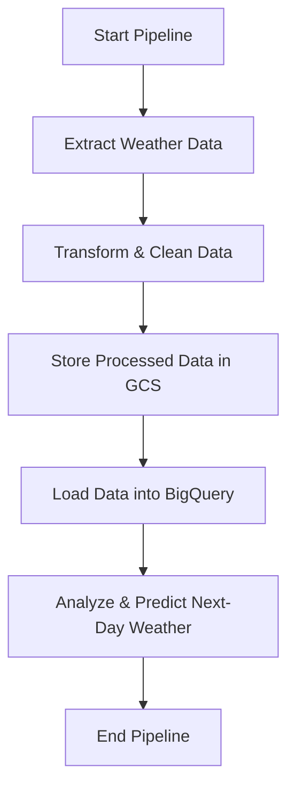

# Weather Data Pipeline

## Overview

This project aims to build a **data pipeline** that extracts past **24-hour weather data** for specified locations, processes the data, and uses it to **predict the next day's weather**. The pipeline is orchestrated using **Apache Airflow**, with **Google Cloud Storage (GCS)** serving as the data storage solution and **Google BigQuery (BQ)** for data analysis and prediction.

By leveraging **cloud-based data orchestration and storage**, this pipeline automates the **extraction, transformation, and loading (ETL) process** while ensuring scalability and reliability.

---

## Components

### **1. ETL Process**
The **Extract, Transform, Load (ETL)** process is the **core of the pipeline** and consists of the following stages:

- **Extraction**: Retrieves weather data for specified locations from the **OpenWeatherMap API**.
- **Transformation**: Processes the raw weather data to extract relevant features and **clean the data** for analysis.
- **Loading**: Stores the **processed data** in **Google Cloud Storage (GCS)** and loads it into **Google BigQuery (BQ)** for further analysis.

### **2. Apache Airflow**
- Used to **orchestrate the pipeline**, ensuring efficient scheduling, monitoring, and dependency management.
- DAGs (Directed Acyclic Graphs) define the workflow for **extracting, transforming, and loading** the weather data.

### **3. Google Cloud Storage (GCS)**
- Acts as **intermediate storage** for processed weather data before being ingested into BigQuery.

### **4. Google BigQuery (BQ)**
- Used for **storing, querying, and analyzing** weather data.
- Runs **SQL-based queries** to derive insights and predict the **next day's weather**.

---

## Workflow

1. The pipeline starts by **extracting** weather data for the specified locations using the **OpenWeatherMap API**.
2. The **raw data** is **transformed**, formatted, and cleaned for analysis.
3. The **processed data** is stored in **Google Cloud Storage (GCS)**.
4. The data is then **loaded into Google BigQuery (BQ)** for further analysis.
5. **Predictions** are generated based on the **past 24-hour weather data** to forecast the **next day's weather**.

---

## Usage

To use this pipeline, you need to **set up** the following:
- **Apache Airflow** (for orchestration)
- **Google Cloud Storage (GCS)** (for intermediate data storage)
- **Google BigQuery (BQ)** (for querying and analysis)
- A list of **locations** for which you want to fetch weather data.
- A scheduled Airflow DAG run (e.g., **daily**) to ensure continuous updates.

---

## Setup

### **1. Environment Setup**
Follow these steps to set up the development environment:

1. **Create a virtual environment and activate it:**
   ```sh
   python -m venv venv
   source venv/bin/activate  # On macOS/Linux
   venv\Scripts\activate  # On Windows
   ```

2. **Install dependencies:**
   ```sh
   pip install -r requirements.txt
   ```

3. **Set up Google Cloud credentials:**
   - Obtain a **Google Cloud Service Account JSON key**.
   - Export the credentials as an environment variable:
     ```sh
     export GOOGLE_APPLICATION_CREDENTIALS="path/to/your-service-account.json"
     ```

### **2. Airflow Configuration**
1. **Initialize the Airflow database:**
   ```sh
   airflow db init
   ```

2. **Start the Airflow webserver:**
   ```sh
   airflow webserver --port 8080
   ```

3. **Start the Airflow scheduler:**
   ```sh
   airflow scheduler
   ```

4. **Access the Airflow UI** at: [http://localhost:8080](http://localhost:8080)

### **3. BigQuery Setup**
1. **Create a new dataset** in **Google BigQuery**:
   ```sql
   CREATE SCHEMA weather_data;
   ```

2. **Create a table** in BigQuery to store the **processed weather data**:
   ```sql
   CREATE TABLE weather_data.weather_forecast (
       location STRING,
       timestamp TIMESTAMP,
       temperature FLOAT64,
       humidity INT64,
       wind_speed FLOAT64,
       weather_condition STRING
   );
   ```

---

## Running the Pipeline

1. **Trigger the Airflow DAG**:
   - Navigate to the Airflow UI ([http://localhost:8080](http://localhost:8080)).
   - Locate the DAG named **`load_weather_data`**.
   - Click on **"Trigger DAG"** to start the pipeline.

2. **Monitor the DAG Execution**:
   - Check the **logs** for each task to verify execution.

3. **Verify Data in BigQuery**:
   - Run the following query in BigQuery to check if the weather data has been successfully loaded:
     ```sql
     SELECT * FROM weather_data.weather_forecast LIMIT 10;
     ```

---

## DAG Structure

Below is a high-level structure of the **Airflow DAG** used for this pipeline:



---

## Expected Output

- **BigQuery Table:** Stores processed weather data with features such as temperature, humidity, wind speed, and weather conditions.
- **Weather Predictions:** Generates **next-day forecasts** based on the past 24 hours of weather data.
- **Airflow DAG Execution Logs:** Logs each step of the ETL process, allowing monitoring and debugging.

---

## Troubleshooting

### **1. Airflow Issues**
- If the **Airflow webserver** does not start, try:
  ```sh
  airflow webserver --port 8080 --debug
  ```

- If DAGs are not appearing, ensure the correct `AIRFLOW_HOME` path:
  ```sh
  echo $AIRFLOW_HOME
  ```

### **2. Google Cloud Issues**
- Ensure that your **Google Cloud Service Account** has `BigQuery Data Editor` and `Storage Admin` roles.
- Verify that the `GOOGLE_APPLICATION_CREDENTIALS` environment variable is correctly set.

---

## Conclusion

This **weather data pipeline project** demonstrates how to **leverage cloud services and data orchestration tools** to build a **scalable and automated system for weather data analysis and prediction**. By using **Apache Airflow**, **Google Cloud Storage**, and **Google BigQuery**, the pipeline efficiently extracts, processes, and analyzes weather data while enabling scheduled automation.

---

## References

- [Apache Airflow Documentation](https://airflow.apache.org/)
- [Google Cloud Storage Docs](https://cloud.google.com/storage/docs/)
- [Google BigQuery Docs](https://cloud.google.com/bigquery/docs/)
- [OpenWeatherMap API](https://openweathermap.org/api)
